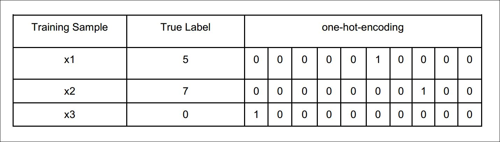
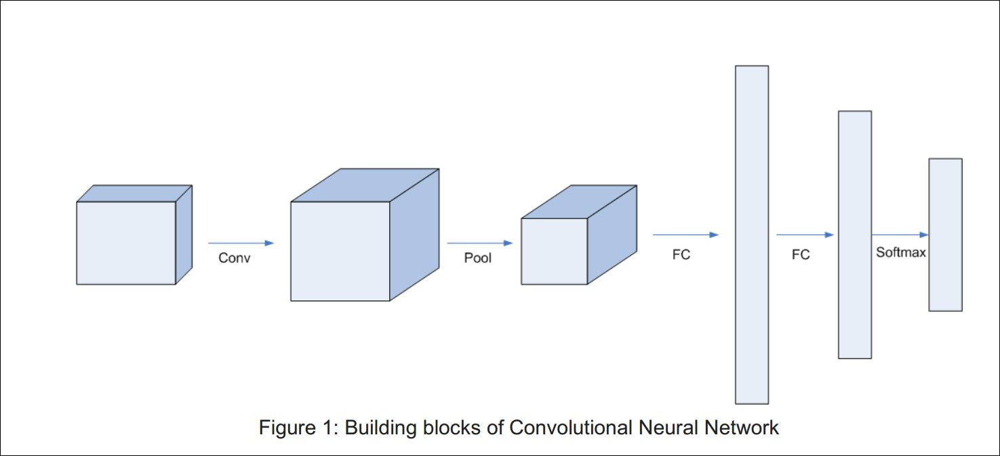
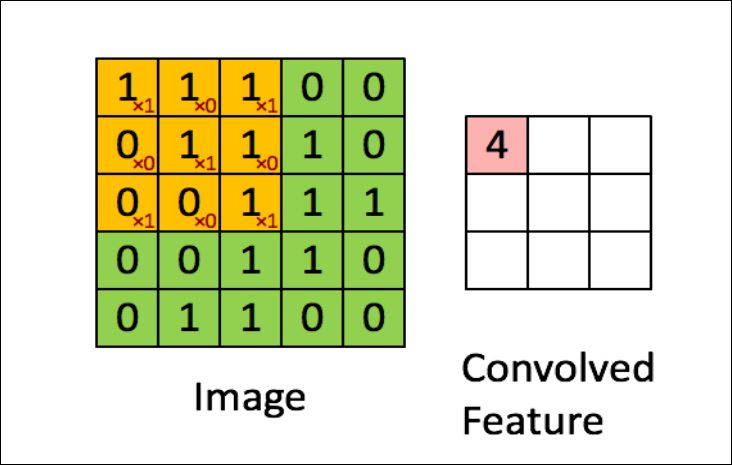

# Implementation-of-Convolutional-Neural-Network-on-MNIST-dataset
This is the implementation of convolutional Neural network which applies a filter bank to image to get the features for neuron with sigmoid and cross entropy.
Use the Filter Banks to get the features for the Neuron with Sigmoid and
cross entropy loss 
### Dataset Details:
You will be using the MNIST dataset, that is attached with the assignment in Task3_Data folder. This dataset contains 60000 training and 10000 test examples. Each example is of 784x1 size, which is a vectorized form of 28x28 (2D grayscale) image. There are 10 classes, that each sample is an image of one of the digits (0 to 9).
To load the dataset you are required to write a function load_dataset that will return you the followings:
train_set_x, train_set_y, test_set_x, test_set_y = load_dataset(path_to_dataset)
### NOTE:
  - train_set_x and test_set_x are numpy arrays of shape (totalSamplesm_train, num_px, num_px), where totalSamplesm_train is total number of train or test images, and num_px is the width and height of images that is 28 in case of MNIST.
  - *_set_x : is being used for the sample,
  - *_set_y : is being for label of the sample.
  - The dimension of train_set_y and test_set_y should be (m_train, 1).
  - Each row of your train_set_x and test_set_x should be an array representing an image. Write a 2 line code in the main notebook to verify that the train_set_x is correctly loaded by visualizing any image using following code (Feel free to change the index value and re-run to see other images):
    - index = 25
    - plt.imshow(train_set_x_orig[index])
To verify that all the data is loaded print the dimension of each variable and you should get the following outputs:
    - train_set_x shape: (60000, 28, 28)
    - test_set_x shape: (10000, 28, 28)
    - train_set_y shape: (60000, 1)
    - test_set_y shape: (10000, 1)
You need to convert the labels to one hot encoding, because we now have 10 classes and their labels are 0,1,2,3...and 9. For each training sample you need to generate a vector of length 10, whose all indices will be zeros except the index of its original label that will be 1. For example:

    - Training Sample True Label one-hot-encoding
    - x1 5 0 0 0 0 0 1 0 0 0 0
    - x2 7 0 0 0 0 0 0 0 1 0 0
    - x3 0 1 0 0 0 0 0 0 0 0 0
### Overview:
You task is to classify the MNIST dataset using the CNN. Instead of learning or backpropagating the CNN layer, you will use the filters provided in Leung Malik Filter Banks. 
Max-Pooling layer will help you to sub-sample and reduce size of the feature volume. This feature volume should be input to Fully Connected Layers. Design and number of layers of FC are up-to you, however, you will have to train FC layers using the backpropagation algorithm.

    - Load dataset
    - For this task the dataset is MNIST.
    - Single step convolution
    - Convolution forward
    - Use the Filter Bank provided to you to initialize your convolutional filters.
    - Pooling forward
    - Use Max-Pooling
    - Vectorizing the output volume
    
    

